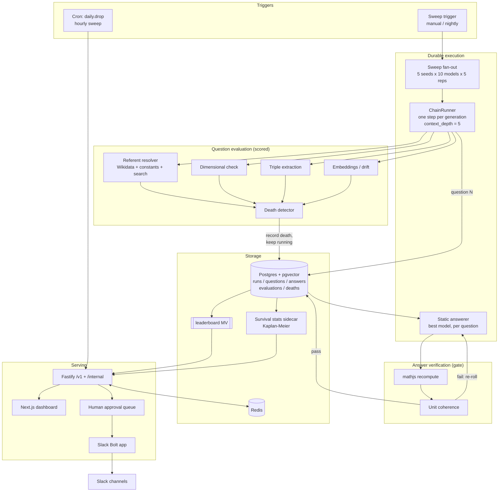
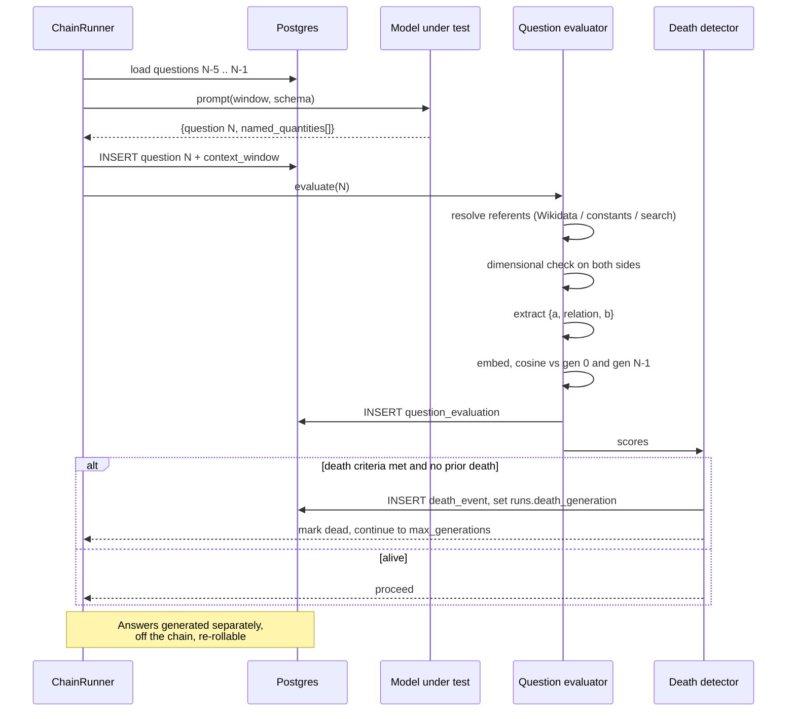

# Driftwood: Semantic Drift Observability Platform

**Doc type:** Architecture spec v0.2 (supersedes v0.1)
**Status:** Ready to build
**Changes from v0.1:** Grading is question-only. Math demoted from leaderboard axis to publish gate. Chain spine split from answers. Sliding context window added. Survival analysis replaces mean collapse depth. Season model added for Track 2 succession.

---

## 1. What this system does, in plain terms

Take a grounded physics question. Ask a model to write a similar one. Feed the new question back. Repeat. Watch the questions stop being about anything real.

**One chain** is one seed question, one model, run in isolation for up to 50 generations. Generation N sees the previous 5 generations of its own chain, nothing else.

**One sweep** is many chains launched together: 5 seeds x 10 models x 5 replicates = 250 independent chains, all parallel, one afternoon.

**The leaderboard** ranks models by how many generations their questions survive before they stop being answerable.

**The drip** replays one already-completed chain to Slack, one generation per day. No live model calls. It is a recording, not a performance.

---

## 2. Locked decisions

| Decision | Value | Rationale |
|---|---|---|
| Grading target | The generated **question** only | Answers are independent per question and stay valuable on their own day |
| Math validity | Publish gate, not a scored axis | Track 2's joke needs correct math on an absurd premise. Wrong math kills the bit but says nothing about drift |
| Death axis | Groundedness (referent resolution, dimensional well-formedness, structural preservation) plus degenerate loop | Objective and countable. Semantic distance stays descriptive |
| Context depth | Last 5 generations, `context_depth = 5` | Damps single-outlier spikes. Depth 1 makes one weird generation permanently redirect the chain |
| Chain length | 50 generations max | Literature puts meaningful model separation inside 30. 50 gives headroom |
| Seeds at launch | 5 | Additive later, invalidates nothing. Spend the budget on replicates instead |
| Replicates | 5 per (model, seed) | Collapse depth is high variance. Without replicates you cannot separate ranking from noise |
| Aggregate metric | Kaplan-Meier median survival with CIs | Chains that reach 50 alive are right-censored. Averaging them in as "50" is wrong |
| Track 2 source | One completed chain, replayed | Rotate seed first, model second. Model changes only when the champion actually changes |

---

## 3. Tech stack

| Layer | Choice |
|---|---|
| Language | TypeScript (Node 22), pnpm + Turborepo |
| Database | Postgres 16 (Neon or Supabase) + `pgvector` |
| Durable execution | Inngest v1, Temporal at scale |
| LLM gateway | OpenRouter or self-hosted LiteLLM |
| LLM tracing | Langfuse (self-hosted) |
| Math verification | `mathjs` + `js-quantities` for dimensional analysis |
| Entity resolution | Wikidata SPARQL + curated constants table + search-grounded fallback |
| Survival stats | `lifelines` via a small Python sidecar, or hand-rolled KM in SQL |
| API | Fastify + zod-to-openapi |
| Frontend | Next.js 15 App Router, Tailwind, shadcn/ui, Recharts |
| Slack | Bolt for JS, HTTP mode |
| Cache | Upstash Redis |
| Hosting | Vercel (web + API), Fly.io (workers) |

---

## 4. Database schema

The central change from v0.1: **`generations` is split into `questions` and `answers`.** Questions form the immutable chain spine. Answers hang off questions and can be re-rolled without disturbing the benchmark. This is what lets you fix a bad daily drop without corrupting the lineage.

```sql
CREATE EXTENSION IF NOT EXISTS vector;
CREATE EXTENSION IF NOT EXISTS pgcrypto;

CREATE TYPE track_type      AS ENUM ('benchmark','drip','experiment');
CREATE TYPE run_status      AS ENUM ('queued','running','dead','survived','failed','cancelled');
CREATE TYPE death_cause     AS ENUM (
  'referent_unresolvable',   -- invented constants the model presents as known
  'dimensionally_malformed', -- the comparison itself is incoherent
  'structure_lost',          -- no longer parses as a computable comparison
  'degenerate_loop',         -- stopped changing; an attractor, not a question
  'format_failure'           -- structured output broke twice running
);

-- ---------- Catalogue ----------

CREATE TABLE models (
  id            UUID PRIMARY KEY DEFAULT gen_random_uuid(),
  provider      TEXT NOT NULL,
  model_key     TEXT NOT NULL UNIQUE,
  pinned_version TEXT,                    -- dated snapshot where the provider offers one
  display_name  TEXT NOT NULL,
  input_cost_per_mtok  NUMERIC(10,4),
  output_cost_per_mtok NUMERIC(10,4),
  is_active     BOOLEAN NOT NULL DEFAULT TRUE,
  metadata      JSONB NOT NULL DEFAULT '{}'
);

CREATE TABLE seeds (
  id            UUID PRIMARY KEY DEFAULT gen_random_uuid(),
  slug          TEXT NOT NULL UNIQUE,
  question_text TEXT NOT NULL,
  domain        TEXT NOT NULL,            -- energy | mass | time | distance | power
  is_active     BOOLEAN NOT NULL DEFAULT TRUE,
  created_at    TIMESTAMPTZ NOT NULL DEFAULT now()
);

CREATE TABLE prompt_templates (
  id            UUID PRIMARY KEY DEFAULT gen_random_uuid(),
  name          TEXT NOT NULL,            -- 'mutate_question' | 'answer_question'
  version       INTEGER NOT NULL,
  body          TEXT NOT NULL,
  output_schema JSONB NOT NULL,
  UNIQUE (name, version)
);

-- Reference values for groundedness checking. Seeded by hand, grown by the resolver.
CREATE TABLE known_quantities (
  id            UUID PRIMARY KEY DEFAULT gen_random_uuid(),
  entity_label  TEXT NOT NULL,            -- 'Porsche Taycan battery capacity'
  wikidata_qid  TEXT,
  value         NUMERIC NOT NULL,
  unit          TEXT NOT NULL,
  dimension     TEXT NOT NULL,            -- 'energy'
  source_url    TEXT,
  confidence    REAL NOT NULL DEFAULT 1.0,
  verified_by_human BOOLEAN NOT NULL DEFAULT FALSE,
  UNIQUE (entity_label, unit)
);

-- ---------- Chains ----------

CREATE TABLE runs (
  id                UUID PRIMARY KEY DEFAULT gen_random_uuid(),
  seed_id           UUID NOT NULL REFERENCES seeds(id),
  model_id          UUID NOT NULL REFERENCES models(id),
  mutate_prompt_id  UUID NOT NULL REFERENCES prompt_templates(id),
  track             track_type NOT NULL,
  status            run_status NOT NULL DEFAULT 'queued',
  context_depth     INTEGER NOT NULL DEFAULT 5,   -- sliding window size
  temperature       NUMERIC(3,2) NOT NULL DEFAULT 1.0,
  max_generations   INTEGER NOT NULL DEFAULT 50,
  replicate_index   INTEGER NOT NULL DEFAULT 0,
  batch_id          UUID,                          -- groups one sweep
  death_generation  INTEGER,                       -- NULL means survived
  censored          BOOLEAN NOT NULL DEFAULT FALSE,-- TRUE when it hit max alive
  total_cost_usd    NUMERIC(12,6) NOT NULL DEFAULT 0,
  config            JSONB NOT NULL DEFAULT '{}',
  started_at        TIMESTAMPTZ,
  ended_at          TIMESTAMPTZ,
  created_at        TIMESTAMPTZ NOT NULL DEFAULT now()
);
CREATE INDEX ON runs (model_id, seed_id, track, context_depth, status);
CREATE INDEX ON runs (batch_id);

-- The chain spine. Immutable once written.
CREATE TABLE questions (
  id                UUID PRIMARY KEY DEFAULT gen_random_uuid(),
  run_id            UUID NOT NULL REFERENCES runs(id) ON DELETE CASCADE,
  gen_index         INTEGER NOT NULL,              -- 0 = the seed
  question_text     TEXT NOT NULL,
  context_window    UUID[] NOT NULL DEFAULT '{}',  -- ids of the questions shown to produce this
  extracted_triple  JSONB,                         -- {quantity_a, relation, quantity_b}
  named_quantities  JSONB NOT NULL DEFAULT '[]',   -- [{label, value, unit, stated_by_model}]
  raw_response      JSONB,
  prompt_tokens     INTEGER,
  completion_tokens INTEGER,
  latency_ms        INTEGER,
  cost_usd          NUMERIC(10,6),
  created_at        TIMESTAMPTZ NOT NULL DEFAULT now(),
  UNIQUE (run_id, gen_index)
);
CREATE INDEX ON questions USING gin (context_window);

CREATE TABLE question_embeddings (
  question_id   UUID NOT NULL REFERENCES questions(id) ON DELETE CASCADE,
  embed_model   TEXT NOT NULL,
  embedding     VECTOR(1536) NOT NULL,
  PRIMARY KEY (question_id, embed_model)
);
CREATE INDEX ON question_embeddings USING hnsw (embedding vector_cosine_ops);

-- Answers hang off questions, one-to-many. Re-rollable. Not part of the chain.
CREATE TABLE answers (
  id                UUID PRIMARY KEY DEFAULT gen_random_uuid(),
  question_id       UUID NOT NULL REFERENCES questions(id) ON DELETE CASCADE,
  model_id          UUID NOT NULL REFERENCES models(id),   -- the static "best answerer"
  attempt           INTEGER NOT NULL DEFAULT 1,
  answer_text       TEXT NOT NULL,
  calculation_steps JSONB NOT NULL DEFAULT '[]',           -- [{expr, value, unit, note}]
  stated_result_value NUMERIC,
  stated_result_unit  TEXT,
  raw_response      JSONB,
  cost_usd          NUMERIC(10,6),
  created_at        TIMESTAMPTZ NOT NULL DEFAULT now(),
  UNIQUE (question_id, model_id, attempt)
);

-- ---------- Evaluation: questions (scored, drives the leaderboard) ----------

CREATE TABLE question_evaluations (
  id                    UUID PRIMARY KEY DEFAULT gen_random_uuid(),
  question_id           UUID NOT NULL REFERENCES questions(id) ON DELETE CASCADE,
  evaluator_version     TEXT NOT NULL,

  -- Axis 1: referent resolution (primary death signal)
  referents_total       INTEGER NOT NULL DEFAULT 0,
  referents_resolved    INTEGER NOT NULL DEFAULT 0,
  fabricated_constants  JSONB NOT NULL DEFAULT '[]',  -- the specific inventions, for the dashboard
  groundedness          REAL,                          -- resolved / total

  -- Axis 2: dimensional well-formedness
  dimension_a           TEXT,
  dimension_b           TEXT,
  comparison_valid      BOOLEAN,

  -- Axis 3: structural preservation
  triple_parsed         BOOLEAN,

  -- Descriptive only, never a death trigger on its own
  drift_from_seed       REAL,
  drift_from_parent     REAL,
  entity_overlap_seed   REAL,

  created_at            TIMESTAMPTZ NOT NULL DEFAULT now(),
  UNIQUE (question_id, evaluator_version)
);
CREATE INDEX ON question_evaluations (question_id) WHERE comparison_valid = FALSE;

-- ---------- Verification: answers (publish gate, never scored) ----------

CREATE TABLE answer_verifications (
  id                UUID PRIMARY KEY DEFAULT gen_random_uuid(),
  answer_id         UUID NOT NULL REFERENCES answers(id) ON DELETE CASCADE,
  verifier_version  TEXT NOT NULL,
  arithmetic_ok     BOOLEAN NOT NULL,
  units_ok          BOOLEAN NOT NULL,
  relative_error    REAL,
  failing_step      INTEGER,
  publishable       BOOLEAN GENERATED ALWAYS AS (arithmetic_ok AND units_ok) STORED,
  detail            JSONB NOT NULL DEFAULT '{}',
  UNIQUE (answer_id, verifier_version)
);

CREATE TABLE death_events (
  id                UUID PRIMARY KEY DEFAULT gen_random_uuid(),
  run_id            UUID NOT NULL REFERENCES runs(id) ON DELETE CASCADE,
  question_id       UUID NOT NULL REFERENCES questions(id),
  gen_index         INTEGER NOT NULL,
  cause             death_cause NOT NULL,
  evaluator_version TEXT NOT NULL,
  evidence          JSONB NOT NULL DEFAULT '{}',
  human_confirmed   BOOLEAN,
  created_at        TIMESTAMPTZ NOT NULL DEFAULT now(),
  UNIQUE (run_id, evaluator_version)   -- one death per run per evaluator
);

-- ---------- Track 2: seasons ----------

CREATE TABLE seasons (
  id              UUID PRIMARY KEY DEFAULT gen_random_uuid(),
  season_number   INTEGER NOT NULL UNIQUE,
  run_id          UUID NOT NULL REFERENCES runs(id),
  queue_position  INTEGER NOT NULL,
  title           TEXT,                              -- 'Season 3: Claude vs the Taycan'
  started_on      DATE,
  ended_on        DATE,
  is_active       BOOLEAN NOT NULL DEFAULT FALSE
);

CREATE TABLE daily_drops (
  id              UUID PRIMARY KEY DEFAULT gen_random_uuid(),
  drop_date       DATE NOT NULL UNIQUE,
  season_id       UUID NOT NULL REFERENCES seasons(id),
  question_id     UUID NOT NULL REFERENCES questions(id),
  answer_id       UUID NOT NULL REFERENCES answers(id),
  is_finale       BOOLEAN NOT NULL DEFAULT FALSE,    -- the generation the chain died
  headline        TEXT,
  approved_by     TEXT,                              -- human veto gate
  published_at    TIMESTAMPTZ
);

CREATE TABLE slack_installations (
  id            UUID PRIMARY KEY DEFAULT gen_random_uuid(),
  team_id       TEXT NOT NULL UNIQUE,
  bot_token_enc BYTEA NOT NULL,
  installed_at  TIMESTAMPTZ NOT NULL DEFAULT now()
);

CREATE TABLE slack_subscriptions (
  id              UUID PRIMARY KEY DEFAULT gen_random_uuid(),
  installation_id UUID NOT NULL REFERENCES slack_installations(id) ON DELETE CASCADE,
  channel_id      TEXT NOT NULL,
  timezone        TEXT NOT NULL DEFAULT 'UTC',
  post_at_local   TIME NOT NULL DEFAULT '09:00',
  is_active       BOOLEAN NOT NULL DEFAULT TRUE,
  UNIQUE (installation_id, channel_id)
);

CREATE TABLE slack_deliveries (
  id              UUID PRIMARY KEY DEFAULT gen_random_uuid(),
  drop_id         UUID NOT NULL REFERENCES daily_drops(id),
  subscription_id UUID NOT NULL REFERENCES slack_subscriptions(id),
  slack_ts        TEXT,
  delivered_at    TIMESTAMPTZ,
  error           TEXT,
  UNIQUE (drop_id, subscription_id)   -- cron retries cannot double-post
);
```

### Leaderboard view

Grouped by `context_depth` as well as model. Depth-1 and depth-5 runs are different experiments and must never be averaged together.

```sql
CREATE MATERIALIZED VIEW leaderboard AS
SELECT
  m.id AS model_id,
  m.display_name,
  r.context_depth,
  count(*)                                          AS chains,
  count(*) FILTER (WHERE r.censored)                AS censored_chains,
  count(*) FILTER (WHERE r.censored)::REAL / count(*) AS survival_rate,
  percentile_cont(0.5) WITHIN GROUP (
    ORDER BY COALESCE(r.death_generation, r.max_generations)
  )                                                 AS naive_median_depth,
  stddev_pop(COALESCE(r.death_generation, r.max_generations)) AS depth_stddev,
  avg(r.total_cost_usd)                             AS avg_cost_usd
FROM runs r
JOIN models m ON m.id = r.model_id
WHERE r.track = 'benchmark' AND r.status IN ('dead','survived')
GROUP BY m.id, m.display_name, r.context_depth;

CREATE UNIQUE INDEX ON leaderboard (model_id, context_depth);
```

`naive_median_depth` is for sorting and quick display. The published rank uses Kaplan-Meier median survival computed in the stats sidecar, which handles censoring correctly. Always show `censored_chains` next to any rank so readers can see how many chains never died.

---

## 5. The evaluation pipeline

### Question evaluation (scored)

**Axis 1: referent resolution.** Extract every named quantity from the question. For each, attempt resolution in order: `known_quantities` table, then Wikidata SPARQL for entities carrying quantity properties, then a search-grounded model call whose result is written back to `known_quantities` with `verified_by_human = FALSE`. Anything unresolvable, or any constant the model asserted as fact without a real referent, counts as fabricated. `groundedness = resolved / total`.

**Axis 2: dimensional well-formedness.** Resolve both sides of the comparison to a physical dimension. "How many A can B charge" requires both to carry energy. A question comparing a mass to a duration is malformed no matter what math follows.

**Axis 3: structural preservation.** Extract `{quantity_a, relation, quantity_b}`. When that no longer parses, the output has stopped being a computable question.

**Descriptive only.** Cosine drift from seed and from parent, entity overlap with the seed. Charted, never a death trigger by itself, with one exception below.

### Death rule (v1)

Fire a death event at the first generation N where any of:

- `groundedness < 0.5` for two consecutive generations
- `comparison_valid = FALSE` for two consecutive generations
- `triple_parsed = FALSE` for two consecutive generations
- `drift_from_parent < 0.02` for four consecutive generations, which is `degenerate_loop`: the chain has hit an attractor and stopped being a chain
- structured output parsing fails twice running

Two-generation persistence everywhere, because single-generation failures are usually sampling noise rather than death.

**Keep running past death.** Continue to `max_generations` and persist everything. Post-death output is where Track 2's comedy peaks, and you will want the data when you revise the threshold.

### Answer verification (gate, not score)

Re-evaluate every `calculation_steps` entry with `mathjs`, check dimensional consistency, compare the recomputed result against `stated_result_value`. If `publishable = FALSE`, re-roll the answer. Never let a failed verification affect the run's death generation or the leaderboard.

### Calibration

Hand-label 50 chains before publishing anything. The thresholds above are starting guesses. Fit them so the detected death generation lands inside the human-judged window.

**The seed-sufficiency test.** After the first full sweep, compare within-model between-seed spread against between-model spread. If a single model's median depth varies more across your 5 seeds than models vary against each other, the aggregate rank is measuring seed quirks. Report per-seed columns until model spread dominates.

---

## 6. API surface

### Public

| Method | Path | Notes |
|---|---|---|
| `GET` | `/v1/leaderboard?depth=5&seed=<slug>` | From the materialised view plus KM medians. `s-maxage=300` |
| `GET` | `/v1/models` / `/v1/models/{key}/stats` | Per-seed breakdown, death-cause histogram |
| `GET` | `/v1/seeds` | The 5 seeds |
| `GET` | `/v1/runs?model=&seed=&depth=&cursor=` | Cursor pagination |
| `GET` | `/v1/runs/{id}/questions?from=&to=` | The chain, with each generation's context window |
| `GET` | `/v1/runs/{id}/drift` | Time series for the chart: gen, groundedness, drift_from_seed, drift_from_parent, alive |
| `GET` | `/v1/runs/{id}/survival` | KM curve points for one model cohort |
| `GET` | `/v1/questions/{id}` | Question plus its answers plus verification status |
| `GET` | `/v1/daily` | Today's drop: seed question, current question, earnest answer, gen index, season |
| `GET` | `/v1/daily/{date}` | Archive. Immutable, `max-age=31536000` |
| `GET` | `/v1/seasons` | Season list with status |
| `GET` | `/v1/compare?runs=a,b,c` | Overlay drift curves |

### Internal

| Method | Path | Notes |
|---|---|---|
| `POST` | `/internal/sweeps` | Fan out seeds x models x replicates. Returns `batch_id`. Requires `Idempotency-Key` |
| `POST` | `/internal/runs/{id}/questions` | Worker appends. Unique `(run_id, gen_index)` makes retries safe |
| `POST` | `/internal/questions/{id}/answers` | Static answerer writes, or re-rolls |
| `POST` | `/internal/questions/{id}/evaluations` | Upsert on `(question_id, evaluator_version)` |
| `POST` | `/internal/answers/{id}/verify` | Publish gate |
| `POST` | `/internal/runs/{id}/death` | Records event, denormalises onto `runs`, sets status |
| `POST` | `/internal/runs/{id}/cancel` | Cooperative, checked between generations |
| `POST` | `/internal/seasons/advance` | Ends current season, activates next in queue |
| `POST` | `/internal/drops/{date}/approve` | Human veto gate before publishing |
| `POST` | `/internal/leaderboard/refresh` | `REFRESH MATERIALIZED VIEW CONCURRENTLY` |

### Slack

`POST /slack/events`, `/slack/commands` (`/drift today`, `/drift leaderboard`, `/drift season`), `/slack/interactions` (show the math, see the original, see the whole chain), `GET /slack/oauth/callback`.

Cron `daily.drop` runs hourly, fires only for subscriptions whose local post time falls in that hour. `slack_deliveries` uniqueness prevents double posts on retry.

---

## 7. Architecture



### One generation, in sequence



---

## 8. Track 2: seasons

A season is one completed chain replayed at one generation per day.

**Succession policy.** When a season exhausts, take the next entry in the `seasons` queue. Default: same champion model, next seed. Swap the model only when a new champion actually takes the leaderboard, which makes the change newsworthy instead of arbitrary. Manual override always available via `queue_position`.

**The finale.** The generation where the chain died gets `is_finale = TRUE`, posts with the drift chart, and closes the season. This turns your most arguable metric into the thing readers anticipate.

**Queue depth is measured in days, not chains.** A 50-generation chain is 50 days. An 8-generation chain is 8. Keep 60 days of approved material queued, alert below 30.

**Human gate.** Comedy does not correlate with any computable score. `daily_drops.approved_by` must be set before publish. Build the review queue in week 5, not later.

---

## 9. Build order

1. **Week 1.** Schema, migrations, gateway wrapper with Zod-enforced structured output. Run one chain by hand at depth 5. Read the output. Your mutate prompt is wrong in interesting ways.
2. **Week 2.** Referent resolver. **This is the long pole.** Wikidata SPARQL, curated constants table, search-grounded fallback with write-back. Budget three weeks and be pleasantly surprised.
3. **Week 3.** Dimensional and structural checks, death detector, ChainRunner as a durable workflow, first full sweep. Hand-label 50 chains and calibrate. Run the seed-sufficiency test.
4. **Week 4.** Survival stats sidecar, leaderboard view, public read API, dashboard with drift chart and KM curves.
5. **Week 5.** Static answerer, math verification gate, human approval queue.
6. **Week 6.** Slack app, seasons, cron drip, Block Kit formatting.
7. **Side experiment, anytime.** Depth sweep: `context_depth` of 1, 5, and full history on one seed and two models. Whether a deeper window smooths drift or accelerates it (the model can see its own trajectory and may extrapolate "get weirder") is an open question and a better headline than the leaderboard.

---

## 10. Priors from the literature

Transmission-chain work gives you useful calibration before you spend anything.

- Mohamed et al. (ACL 2025) ran iterative translation chains and found distortion accumulates steadily, modulated by chain complexity and prompt constraint.
- A 30-iteration paraphrase replication across 17 open-weight models found enormous between-model spread, with the strongest holding above 0.9 embedding similarity while the weakest fell to roughly 0.2.
- Perez et al. (ICLR 2025) found chains converge toward **attractor states** rather than diverging forever. This is why `degenerate_loop` is a death cause: a model can plateau at "wrong but stable" and never trip a drift threshold.

**Caveat.** All of that work uses preservation tasks where the instruction is "keep the meaning." Yours instructs mutation, which licenses divergence. Expect faster death than published figures, and expect strong entity attractors (blue whales, Olympic pools, Hiroshima-equivalents). Nobody has published on grounded-mutation chains, which is both your novelty claim and why you cannot inherit a threshold.

---

## 11. Risks

- **Reproducibility.** Pin dated model versions. Record gateway response metadata. Re-run the full sweep when a version changes. A leaderboard you cannot re-derive is entertainment, not measurement.
- **Resolver accuracy.** The entire leaderboard rests on referent resolution. False "fabricated" flags kill chains early and unfairly. Track resolver precision against the human-labelled set and publish it.
- **Temperature confound.** Fix it across the leaderboard or report it as a dimension. Never mix.
- **Cost.** One sweep at 5 x 10 x 5 x 50 is about 12,500 mutate calls plus answers. Set per-batch caps in `runs.config` and halt on breach.
- **Comedy is not a metric.** The human veto is load-bearing.
